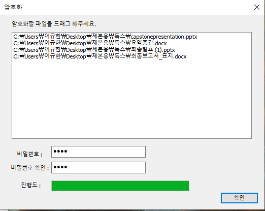
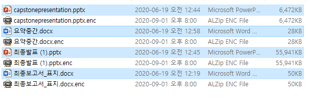
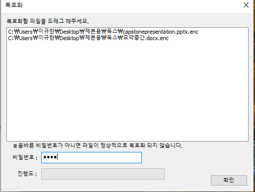

# HelloCrypt
KISA의 aria를 사용한 암호화 프로그램 입니다.

mfc로 제작했습니다.
파일의 크기가 커서 src 파일만을 업로드 했습니다.   
   
#
1. 프로그램을 실행하면 다음과 같은 화면이 출력됩니다.
</img>

#
2. 암호화를 누르면 다음과 같은 화면이 나옵니다.
</img>

#
3. 원하는 파일들을 드래그 하여 추가합니다.
</img>

#
4. 확인을 누르면 암호화가 진행됩니다.   
</img>

#
5. 다음과 같이 확장자가 enc인 암호화된 파일이 생성됩니다.  
</img>   
   
   
#
6. 이와 같은 방법으로 .enc 파일을 붙여넣으면 복호화가 진행되며 파일이 복구됩니다.
</img>   
